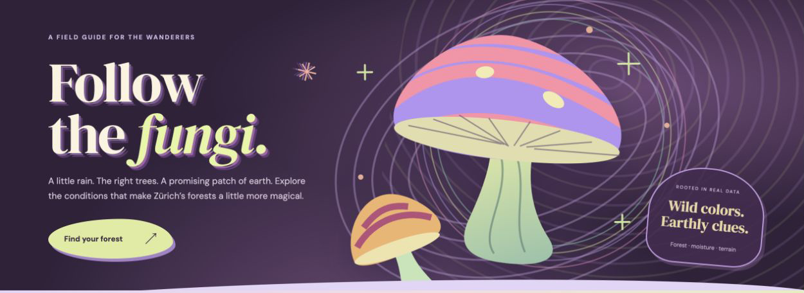

# shrooms

**Follow the fungi.** Explore mushroom habitat across **Switzerland**, compare species, and keep a private forest notebook.

[](https://github.com/andrinr/shrooms/actions/workflows/ci.yml)
[](LICENSE)

## Explore


*Zürich map walkthrough recorded September 2026, before the nationwide expansion. Scores illustrate the interface, not current conditions. Basemap: GIS-ZH and © [OpenStreetMap contributors](https://www.openstreetmap.org/copyright).*

- **Locate yourself:** an optional browser location button shows your position and accuracy on the map, without saving or sending coordinates to the backend. Online map tiles reveal the viewed area to swisstopo; use the bundled map to avoid those requests.
- **Five languages:** Deutsch, Français, Italiano, Rumantsch Grischun and English, including map explanations, warnings and accounts.
- **Zoom-aware Swiss map:** swisstopo topography across all cantons, with roads, names and contours above the heatmap. Switch to the bundled offline map anytime; blocked tiles automatically fall back.
- **All 26 cantons:** a lightweight Swiss overview and regional data loaded on demand.
- **Finer habitat detail:** 50 m cells in Zürich, 100 m elsewhere, and a 500 m national overview. Source precision varies; national terrain remains 200 m.
- **Eleven mushrooms:** the original seven plus winter chanterelle, slippery jack, spruce milkcap and charcoal burner. Every profile includes ecological references and missing indicators.
- **Explainable scores:** tree mix, moisture, temperature, slope, aspect and season. Missing inputs are explicitly omitted.
- **Private accounts and saved spots:** names, notes, species, export, recovery codes and account deletion. Locations are never shared publicly.
- **Shared weather:** the backend refreshes a cached snapshot every six hours, instead of making every visitor contact the provider.
- **Protected-area overlays:** named boundaries and collection warnings, with partial coverage clearly marked.
- **Bundled maps:** no dependency on live map tiles; pan, zoom, search municipalities and inspect forest cells.

> Scores are **unvalidated habitat suitability estimates**, not calibrated probabilities, mushroom sightings, or permission to collect. Check local rules and have mushrooms professionally identified before eating them.

## Run locally

Requires **Node.js 24 or newer**. There are no runtime npm dependencies.

```sh
git clone git@github.com:andrinr/shrooms.git
cd shrooms
npm run build
npm start
```

Open **http://localhost:3000**. Accounts and weather cache persist in `.storage/`, which is excluded from Git and frontend builds. Save the recovery code shown when creating an account; no email service is required.

## Deploy cheaply

The recommended setup is **one small Linux server with Docker Compose**, SQLite and Caddy for automatic HTTPS. A 4 GB server leaves room for the nationwide data cache and deployment builds. Budget roughly **CHF 5–10/month**, plus domain and backup storage; actual provider prices and taxes vary.

```sh
cp .env.example .env
# Set DOMAIN to a hostname pointing to your server.
docker compose up -d --build
```

**[Deployment, upgrades and backups](docs/deployment.md)** · **[API reference](docs/api.md)** · **[Architecture](docs/architecture.md)**

No managed database, email provider or separate frontend hosting is needed. The free Open-Meteo endpoint is for non-commercial use; commercial deployments can set `OPEN_METEO_API_KEY`.

### Static preview

GitHub Pages and direct `index.html` previews still work for the map. Accounts and scheduled updates require the backend. Publish `_site/` or use Pages from `main` at the repository root. Static mode uses dated bundled weather with optional browser refresh; weather older than 48 hours is excluded from scoring.

## Data and resolution

| Region / source | Detail and limitations |
| --- | --- |
| Zürich: GIS-ZH surveys and DTM | 197,669 forest cells at 50 m; surveyed tree shares and canopy |
| Other cantons: © swisstopo swissTLMRegio | Forest boundaries rasterized at 100 m; generalized regional mapping |
| FOEN / WSL National Forest Inventory | 2023 tree mix from a 10 m raster, aggregated to cells; individual host-tree shares and canopy unavailable |
| © swisstopo DHM25/200 | National elevation, slope and aspect from a 200 m source |
| Open-Meteo | Regional weather anchors; interpolation does not add local measurements |

Forest shape, terrain resolution, and weather resolution are different. Smaller cells do not establish equally precise mushroom forecasts. Protection coverage is incomplete throughout Switzerland.

**[Model, provenance and limitations](docs/model-and-data.md)** · **[Data preparation](docs/development.md)**

## Checks

```sh
npm run check
npm test
```

CI checks the model, all regional data, authentication, privacy, persistence, weather caching and frontend assets. A separate job builds the deployment container, checks its health, restarts it, and verifies a SQLite backup. Tests use fixed dates and committed datasets.

## Add mushrooms through GitHub

No coding required: [suggest a species](https://github.com/andrinr/shrooms/issues/new?template=species.yml) or [propose a habitat indicator](https://github.com/andrinr/shrooms/issues/new?template=indicator.yml). Include the scientific name, ecological evidence and data gaps.

For a pull request, most species need only a profile and translations. The map, API and notebook discover them automatically. **[Contribution guide with a copyable example, indicator reference and checks](CONTRIBUTING.md)**.

## License

Original code, scripts, documentation and artwork are **[MIT licensed](LICENSE)**. External data and libraries retain their own terms. See **[third-party notices](THIRD_PARTY_NOTICES.md)** for attribution and service restrictions.
